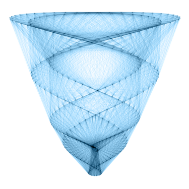
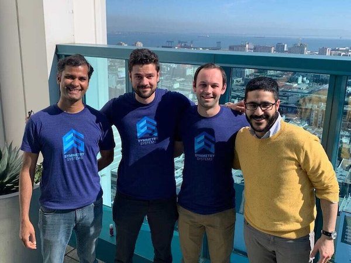

# Joining Symmetry Systems
A project for candidates to learn a little bit about Symmetry Systems and explore our take-home coding challenges.

Symmetry is a new kind of security company. We apply machine learning with precision and speed to help our customers better understand and protect their large fleets of data stores and applications. Our goal is to provide visibility and actionability to engineering organizations and security teams globally responsible for managing data and identity management risk. We do all of this without impacting developer productivity, while creating symmetry and balance between Engineering and Security teams.

We are a kind and trustworthy team. We believe in a blameless culture, focused on working together toward one mission and goal. We take pride in our work and apply a craftsmanship rigor to building our product each and every day.

We look for candidates who exhibit an entrepreneurial spirit and want to shape the future of this product with a bit of personal creativity. You are passionate about your work, show attention to detail, take initiative, have an infectious team spirit, and of course exhibit a collaborative attitude. It doesn’t hurt to have a good sense of humor too! We are especially interested if you love telling compelling visual stories about rich data experiences.

If you are up for the challenge, take a look at our [careers page and apply](https://jobs.lever.co/SymmetrySystems) today. If nothing catches your eye, send us your resume at careers@symmetry-systems.com and we will see what we can do to find a spot on our team for you.

# Technologies We Use
We are a team of polyglots. While we have a specific tool belt of technologies we use day to day, we are a team willing to explore new languages and technologies.

Python * Flask * JavaScript * ReactJS * TypeScript * GraphQL * Kibana * ElasticSearch * Docker * Kubernetes * Terraform * R * TensorFlow *

# Kinds of Positions We are Hiring
Symmetry is growing leaps and bounds. Today we are a team of about 10, but we plan to double or possibly triple in the next 12 months. We keep an open mind about hiring before something becomes a critical need. We would rather have depth to our team as we are building out the next version of our product evolution.

* Backend Developers: Today our backend is mostly written in Python/Flask. We use MySQL, Redis and ElasticSearch for all of our ephemeral and persistent data storage. The future might entertain Go or another statically typed language. You would get tons of exposure to AWS, Azure and GCP. This team experiments with every data store technology you can imagine (relational or non-relational).
* Product Design: This group makes our customer experience 1000% better. You will work closely with customers, prospects and our product leadership. You will pair closely with our front-end team and make a rich, user experience.
* Front-End Developers: Our future is in ReactJS. We would love to add folks to the team who want to make use of TypeScript, GraphQL and either Redux or MobX. We use Enzyme, Prettier, Jest, Storybook, Chromatic and Cypress.
* Cloud Operations: Our cloud team is very much a part of our product architecture. Since we deploy the Symmetry stack inside all of our customers, you are part of the team that builds our entire reference architecture.
* Machine Learning: Chance to work with other incredible ML experts on anomaly detection and other machine learning features.
* Cloud Security: This group is responsible for continuous threat modeling and helping our team harden the Symmetry deployment.
* Solution Engineer: Do you like working with customers in the field? Are you a technology generalist with experience deploying and mobilizing software? If so, this is a great role to join our team and be an extension of our engineering team in the field.

# First 90 days in a Nutshell
Day one starts with opening your welcome box and meeting the team. You will have time to setup your development environment and configure accounts on the tools we use. We predominately use the GSuite for mail, calendaring, documentation and presentations. Our source code systems are GitLab for private IP and GitHub for public IP. We use Slack for chat and Zoom for video communication. We love [ReadMe](https://readme.com/) for all documentation. Feel free to select the IDE of your choice or if you are like our CTO you simply use VIM. We will set up on our AWS account, as well as our Azure and GCP test grounds. We have other tools that are in flight such as Zendesk, JIRA, ClickApp, Figma and Cypress.  You will send a welcome blog or email introducing yourself to the entire team.

The rest of your first week will be on-boarding. We will have you meet the entire team to learn about the Symmetry history and core values. Either on your first day or early on your second day, you will set up your development environment ready to work independently. You’ll be able to begin contributing to the team with stress-free contributions that will help you get up to speed, as well as become familiar with Symmetry.

We move pretty quick as a development team. In less than a month you will be fully integrated into our agile ceremonies making value-added contributions to our product. You’ll be taking part in design discussions, you’ll be a real contributor to the team, as well as join all product-related meetings that bring new ideas and make an impact. A member of the team will be a mentor to get you not only acclimated, but comfortable to make proactive recommendations to our product and processes.

Within 3 months time, you will be a full fledged contributor in terms of development and team initiatives. We might have added a couple teammates along the way. You will likely take on some mentoring responsibilities as well.

After the first 3 months here at Symmetry, you might feel like an old timer by now. Things will come easy. You will feel engaged. You will feel empowered. Most importantly, you will feel like you are a part of something really special!

# What We Offer
* Competitive salary and equity package.
* 401k with matching program, up to 4% matching.
* Comprehensive health coverage (medical, dental and vision).
* Work from anywhere experience.
* Generous on-boarding allowance to create an exceptional work from anywhere experience.
* Welcome swag box full of fun goodies and gear.
* Unlimited PTO and company holidays with a required 2 weeks time-off to refresh the mind and body.
* Annual professional development fund for certifications, conferences, books and training classes.
* Paid parental leave.
* Continuous training and mentorship.
* Life insurance and disability benefits.

# Take Home Assignment
Candidates applying for one of our open positions are given the option of working one of our coding challenges or can choose from one of the options below. Code challenges are a common part of technical interviewing. Some candidates prefer it as it gives them time and an environment where they are comfortable working their magic. Some candidates do not want to work on a code challenge in their spare time. We try to be respectful to a candidate's preference. As such we will accommodate any of the technical interview options. It will not have any impact on a candidate's outcome.

* A hands-on technical interview with members of the Symmetry engineering team.
* Present a relevant/applicable OSS project you worked in the past.
* Take a skills assessment via Triplebyte.

If you do choose to work on a take-home assignment, we as that you complete your assignment in a week or less. Our assignments are structured to take roughly 2-4 hours based on your skill level. The current take home assignments can be [found here](assignments.md).

# A Little Bit of History About Symmetry
The founding members of Symmetry Systems came out of the Electrical and Computer Engineering department at the University Texas at Austin. Our founders, [Mohit](https://www.linkedin.com/in/mohit-tiwari8/) and [Casen](https://www.linkedin.com/in/casen-hunger-780765a2/). They worked closely at UT Austin in the [Spark Research Lab](http://spark.ece.utexas.edu/). Initially, the pair launched a product called Blox, which was a service mesh with built-in privacy and security services for application creators and users, and convinced a few other friends and colleagues to start up a new company called Symmetry Systems.

It's here at Symmetry that the team has collaborated closely with cloud-native design partners and received feedback from over a hundred organizations to incubate and bring to market Symmetry DataGuard. Symmetry is now a venture-backed software security provider with members across the United States and globally in Australia and India. Our journey is just beginning. We encourage you to consider joining us!   

Follow us here:
* [Twitter](https://twitter.com/SymmetrySystems)
* [LinkedIn](https://www.linkedin.com/company/symmetry-systems-inc/)
* [Crunchbase](https://www.crunchbase.com/organization/symmetry-systems)
* [Symmetry Systems Web Site](https://www.symmetry-systems.com/)
